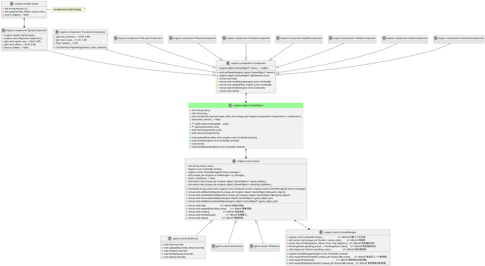

## 看一下类图

### 引擎基础模块类图

```plantuml
@startuml

set namespaceSeparator none
' page 2x2
' skinparam pageMargin 10
' skinparam pageExternalColor green
' skinparam pageBorderColor green

class engine::core::GameApp  #header:palegreen;line:palegreen
{
    - SDL_Window* window_ = nullptr;
    - SDL_Renderer* sdl_renderer_ = nullptr;
    - bool is_running_ = false;
    - {field} std::function<void(engine::scene::SceneManager&)> scene_setup_func_;
    ..
    - std::unique_ptr<engine::core::Time> time_;
    - std::unique_ptr<engine::resource::ResourceManager> resource_manager_;
    - std::unique_ptr<engine::render::Renderer> renderer_;
    - std::unique_ptr<engine::render::Camera> camera_;
    - std::unique_ptr<engine::render::TextRenderer> text_renderer_;
    - std::unique_ptr<engine::core::Config> config_;
    - std::unique_ptr<engine::input::InputManager> input_manager_;
    - std::unique_ptr<engine::core::Context> context_;
    - std::unique_ptr<engine::scene::SceneManager> scene_manager_;
    - std::unique_ptr<engine::physics::PhysicsEngine> physics_engine_;
    - std::unique_ptr<engine::audio::AudioPlayer> audio_player_;
    - std::unique_ptr<engine::core::GameState> game_state_;
    --
    + void run();
    + void oneIter();
    + void registerSceneSetup(std::function<void(engine::scene::SceneManager&)> func);
}

class engine::core::GameState
{

}

class engine::audio::AudioPlayer
{

}

class engine::physics::PhysicsEngine
{

}

class engine::scene::SceneManager
{

}

class engine::core::Context
{

}

class engine::core::Time
{

}

class engine::resource::ResourceManager
{
    - std::unique_ptr<TextureManager> texture_manager_;
    - std::unique_ptr<AudioManager> audio_manager_;
    - std::unique_ptr<FontManager> font_manager_;

}

class engine::render::Renderer
{
    - SDL_Renderer* renderer_ = nullptr;
    - engine::resource::ResourceManager* resource_manager_ = nullptr;
    + Renderer(SDL_Renderer* sdl_renderer, engine::resource::ResourceManager* resource_manager);
}

class engine::render::Camera
{
    - glm::vec2 viewport_size_;
    - glm::vec2 position_;
    - std::optional<engine::utils::Rect> limit_bounds_;
    - float smooth_speed_ = 5.0f;
    - engine::component::TransformComponent* target_ = nullptr;
    + void update(float delta_time);
    + void move(const glm::vec2& offset);


}

class engine::render::TextRenderer
{

}

class engine::core::Config
{
    + bool loadFromFile(std::string_view filepath);
    + bool saveToFile(std::string_view filepath);
}

class engine::input::InputManager
{
    - SDL_Renderer* sdl_renderer_;
    - std::unordered_map<std::string, std::vector<std::string>> actions_to_keyname_map_;
    - std::unordered_map<std::variant<SDL_Scancode, Uint32>, std::vector<std::string>> input_to_actions_map_;

    - std::unordered_map<std::string, ActionState> action_states_;
    - bool should_quit_ = false;
    - glm::vec2 mouse_position_;
    {field} ...

    + void update();
    + bool shouldQuit() const;
    + glm::vec2 getMousePosition() const;
    + glm::vec2 getLogicalMousePosition() const;
    {method} ...
}
' 注释属性或方法，失败(大约是不能与namespace一起用)！
' note left of InputManager::"sdl_renderer_"
'     用于获取鼠标位置
' end note
' note “用于获取鼠标位置“ as N1
' N1 .. engine::input::InputManager:sdl_renderer_


engine::core::GameApp *--> engine::core::Time
engine::core::GameApp *--> engine::resource::ResourceManager
engine::core::GameApp *--> engine::render::Renderer
engine::core::GameApp *--> engine::render::Camera
' engine::core::GameApp *--> engine::render::TextRenderer
engine::core::GameApp *--> engine::core::Config
engine::core::GameApp *--> engine::input::InputManager
' engine::core::GameApp *--> engine::core::Context
' engine::core::GameApp *--> engine::scene::SceneManager
' engine::core::GameApp *--> engine::physics::PhysicsEngine
' engine::core::GameApp *--> engine::audio::AudioPlayer
' engine::core::GameApp *--> engine::core::GameState

engine::render::Renderer *--> engine::resource::ResourceManager
' engine::render::Renderer --> engine::render::Camera

class engine::resource::TextureManager
{
    - std::unordered_map textures_;
    - SDL_Texture* loadTexture(std::string_view file_path);
    - SDL_Texture* getTexture(std::string_view file_path);
    - glm::vec2 getTextureSize(std::string_view file_path);
    - void unloadTexture(std::string_view file_path);
    - void clearTextures();

}
class engine::resource::AudioManager
{
    - std::unordered_map sounds_;
    - Mix_Chunk* loadSound(std::string_view file_path);
    - Mix_Chunk* getSound(std::string_view file_path);
    - void unloadSound(std::string_view file_path);
    - void clearSounds();

}
class engine::resource::FontManager
{
    - std::unordered_map fonts_;
    - TTF_Font* loadFont(std::string_view file_path, int point_size);
    - TTF_Font* getFont(std::string_view file_path, int point_size);
    - void unloadFont(std::string_view file_path, int point_size);
    - void clearFonts();
}

engine::resource::ResourceManager *--> engine::resource::TextureManager
engine::resource::ResourceManager *--> engine::resource::AudioManager
engine::resource::ResourceManager *--> engine::resource::FontManager

@enduml
```

<!-- diagram id="gameapp" caption: "引擎基础模块类图" -->

### 场景、对象与组件类图
- GameObject 上每种 Component(含子类)有且仅有一个
- Scene 内有一个 GameObject 容器，一个场景内有多个GameObject

<!-- diagram id="scene" caption: "场景、对象与组件类图" -->
