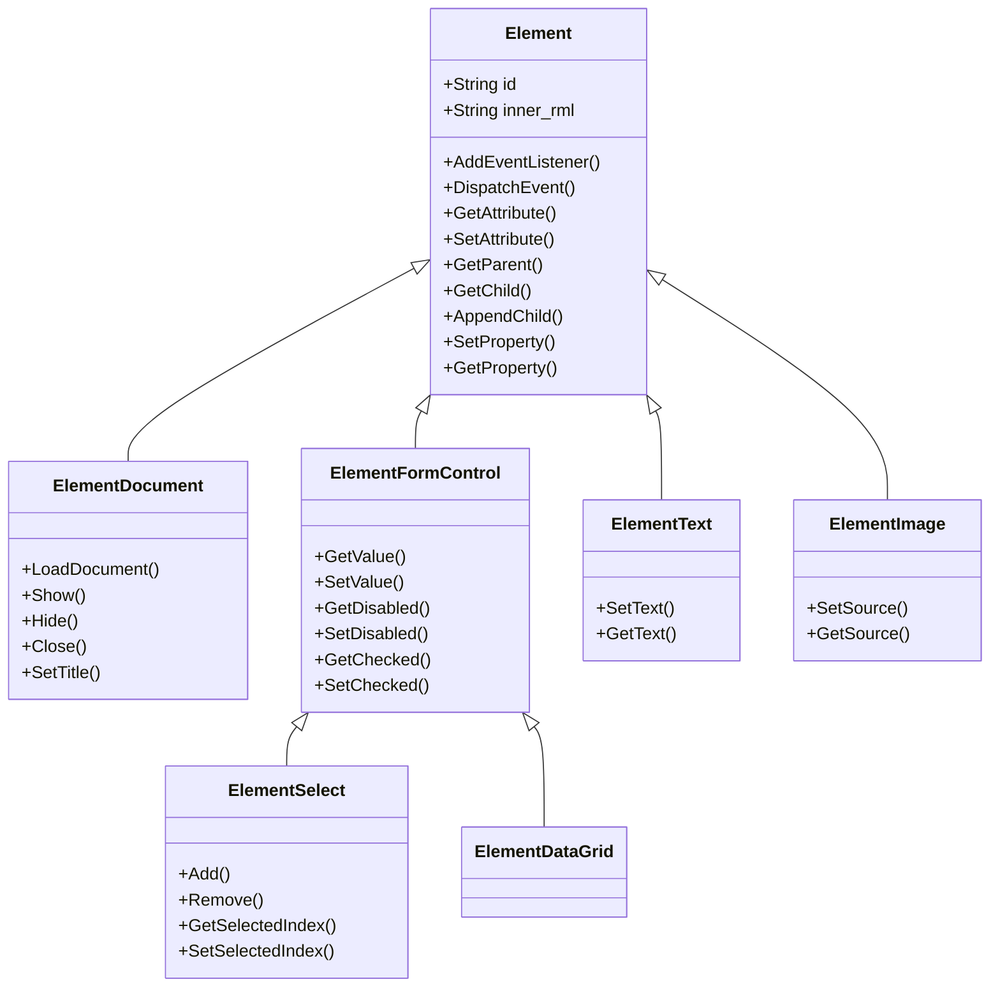

# 1.2 核心概念

理解 RmlUi 的核心概念是掌握这个库的基础。本节将介绍最关键的几个概念及其相互关系。

---

## 一、整体架构图

```
┌─────────────────────────────────────────────────────────────┐
│                      你的游戏/应用                           │
├─────────────────────────────────────────────────────────────┤
│                        RmlUi                                 │
│  ┌─────────────────────────────────────────────────────┐    │
│  │                    Context                          │    │
│  │  ┌──────────────┐  ┌──────────────┐                │    │
│  │  │  Document 1  │  │  Document 2  │   ...          │    │
│  │  │  (menu.rml)  │  │ (inventory)  │                │    │
│  │  │  ┌────────┐  │  │  ┌────────┐  │                │    │
│  │  │  │Element │  │  │  │Element │  │                │    │
│  │  │  │  Tree  │  │  │  │  Tree  │  │                │    │
│  │  │  └────────┘  │  │  └────────┘  │                │    │
│  │  └──────────────┘  └──────────────┘                │    │
│  └─────────────────────────────────────────────────────┘   │
│                              │                             │
│                              ▼                             │
│  ┌─────────────────────────────────────────────────────┐   │
│  │              RenderInterface（你实现）                    │
│  │         顶点、索引、纹理、绘制命令                      │    │
│  └─────────────────────────────────────────────────────┘    │
└─────────────────────────────────────────────────────────────┘
                               │
                               ▼
                    ┌───────────────────┐
                    │   你的渲染引擎     │
                    │  (OpenGL/Vulkan)  │
                    └───────────────────┘
```

---

## 二、核心组件详解

### 1. Context（上下文）

**Context 是 RmlUi 的核心管理对象**，每个 Context 管理：
- 一组 Document（文档）
- 输入事件处理
- 布局计算和渲染准备

```cpp
#include <RmlUi/Core.h>

// 创建 Context
Rml::Context* context = Rml::CreateContext("main", Rml::Vector2i(1920, 1080));

// Context 的主要方法
context->LoadDocument("menu.rml");     // 加载文档
context->UnloadDocument(document);     // 卸载文档
context->Update();                      // 更新（布局、动画等）
context->Render();                      // 渲染准备
```

**关键点**：
- 可以创建多个 Context（例如：游戏 UI 一个，编辑器 UI 一个）
- Context 有自己的尺寸，独立于窗口大小
- 所有输入事件都通过 Context 传递

---

### 2. Document（文档）

**Document 是一个 RML 文件加载后的实例**，类似于 HTML 中的 `window.document`。

```cpp
// 加载文档
Rml::ElementDocument* document = context->LoadDocument("menu.rml");

// 显示文档
document->Show();

// 隐藏文档
document->Hide();

// 从文档获取元素
Rml::Element* title = document->GetElementById("title");
```

**Document 特性**：
- 每个文档有自己的 RML 和 RCSS
- 文档可以模态显示（阻止其他文档输入）
- 文档有 Z 索引顺序

---

### 3. Element（元素）

**Element 是 UI 的基本组成单元**，类似于 HTML 中的 DOM 元素。

```cpp
// 获取元素
Rml::Element* element = document->GetElementById("my_button");

// 修改样式
element->SetProperty("background-color", "rgba(255, 0, 0, 0.5)");
element->SetProperty("width", "200px");

// 修改内容
element->SetInnerRML("<span>Hello World</span>");

// 添加/移除类
element->AddClass("active");
element->RemoveClass("inactive");

// 遍历子元素
for (int i = 0; i < element->GetNumChildren(); i++) {
    Rml::Element* child = element->GetChild(i);
    // 处理子元素...
}
```

**Element 类型**：

RmlUi 中的 Element 类采用继承体系设计，不同类型的元素具有不同的功能：

| 类型 | 说明 | 示例 |
|------|------|------|
| `Element` | 基础元素类，所有元素的基类 | `<div>`, `<span>` |
| `ElementDocument` | 文档根元素，代表整个RML文档 | `<rml>` |
| `ElementFormControl` | 表单控件基类，处理用户输入 | `<input>`, `<textarea>`, `<select>` |
| `ElementText` | 纯文本元素 | 纯文本内容 |
| `ElementImage` | 图片元素 | `` |
| `ElementDataGrid` | 数据网格元素 | 用于数据绑定 |
| `ElementTabSet` | 标签页容器 | `<tabset>`, `<tab>` |
| `ElementSelect` | 下拉选择框 | `<select>` |
| 自定义元素 | 用户扩展的元素类型 | 通过插件或自定义代码创建 |

**Element 类继承关系图**：



**常用的内置Element子类**：

```cpp
// 基础元素 - 所有HTML/RML标签的基础
Element* div = document->GetElementById("my-div");

// 文档元素 - 代表整个RML文档
ElementDocument* doc = document;

// 表单控件 - 处理用户输入
ElementFormControl* input = dynamic_cast<ElementFormControl*>(
    document->GetElementById("my-input")
);

// 选择框 - 特殊的表单控件
ElementSelect* select = dynamic_cast<ElementSelect*>(
    document->GetElementById("my-select")
);

// 文本元素 - 纯文本
ElementText* text = dynamic_cast<ElementText*>(
    document->GetElementById("my-text")
);
```

---

### 4. RenderInterface（渲染接口）

**RenderInterface 是 RmlUi 与你的渲染引擎之间的桥梁**。

```cpp
class MyRenderInterface : public Rml::RenderInterface
{
    void RenderGeometry(Rml::Span<const Rml::Vertex> vertices,
                        Rml::Span<const int> indices,
                        Rml::TextureHandle texture,
                        const Rml::Matrix4f& transform) override
    {
        // 1. 将顶点转换为你的引擎格式
        // 2. 绑定纹理
        // 3. 执行绘制调用
    }

    Rml::TextureHandle LoadTexture(Rml::Vector2i& dimensions,
                                   const Rml::String& source) override
    {
        // 加载纹理并返回句柄
        return my_texture_system.LoadTexture(source);
    }

    // ... 其他接口方法
};
```

**重要提示**：
- RmlUi **不会**直接渲染，它只生成顶点和绘制命令
- 你必须实现 RenderInterface 来完成实际渲染
- 可以使用官方提供的后端（推荐初学者）

---

## 三、典型工作流程

### 初始化阶段

```cpp
// 1. 创建并设置渲染接口
MyRenderInterface render_interface;
Rml::SetRenderInterface(&render_interface);

// 2. 初始化 RmlUi
Rml::Initialise();

// 3. 创建 Context
Rml::Context* context = Rml::CreateContext("main", Rml::Vector2i(1920, 1080));

// 4. 加载字体
Rml::LoadFontFace("fonts/LatoLatin-Regular.ttf");

// 5. 加载文档
Rml::ElementDocument* document = context->LoadDocument("menu.rml");
document->Show();
```

### 主循环阶段

```cpp
while (game_running)
{
    // 1. 处理输入事件
    context->ProcessMouseMove(x, y, buttons);
    context->ProcessMouseButton(x, y, button, down);
    context->ProcessKeyDown(key);

    // 2. 更新 RmlUi（布局、动画、数据绑定）
    context->Update();

    // 3. 渲染
    BeginFrame();           // 你的渲染系统
    context->Render();      // RmlUi 提交绘制命令
    EndFrame();             // 呈现
}
```

### 关闭阶段

```cpp
Rml::Shutdown();
```

---

## 四、关键关系图

```
Context (管理)
   │
   ├─> Document 1 (包含)
   │      │
   │      └─> Element Tree (元素树)
   │             ├─> div#container
   │             │      ├─> h1#title
   │             │      └─> button#start
   │             └─> div#overlay
   │
   ├─> Document 2 (包含)
   │      └─> Element Tree
   │
   └─> Input Events (发送到)
          └─> Active Document

RenderInterface (被使用)
   │
   └─> 接收来自 Context->Render() 的顶点和命令
```

**Active Document（活动文档）**：

Active Document 是当前接收用户输入（键盘、鼠标事件）的文档。一个 Context 可以同时加载多个 Document，但同一时间只有一个 Document 是 Active Document。

**Active Document 的作用**：
- 接收键盘输入事件（`ProcessKeyDown`, `ProcessKeyChar`）
- 接收鼠标输入事件（`ProcessMouseMove`, `ProcessMouseButton`）
- 处理文本输入
- 管理焦点状态

**切换 Active Document**：

```cpp
// 方法1：通过 Show() 方法激活
document1->Show(Rml::ModalFlag::None, Rml::FocusFlag::Auto);  // 自动激活
document2->Show(Rml::ModalFlag::None, Rml::FocusFlag::None);  // 不激活

// 方法2：通过 PullToFront() 激活
document2->PullToFront();  // 将文档移到前台并激活

// 方法3：查看当前活动文档
Rml::ElementDocument* active_doc = context->GetFocusDocument();
```

**Active Document 的选择逻辑**：
1. **Modal 文档优先**：如果有模态对话框显示，它会自动成为 Active Document
2. **Z-顺序**：在非模态情况下，最后显示（Z-index 最高）的文档成为 Active Document
3. **显式设置**：可以通过 `PullToFront()` 或 `Show()` 的 `FocusFlag` 参数控制
4. **用户交互**：用户点击某个文档会自动将其设为 Active Document

**应用场景**：
- **游戏菜单 + HUD**：HUD 可以在后台显示，但菜单接收用户输入
- **多窗口编辑器**：用户点击哪个窗口，哪个窗口就成为活动窗口
- **对话框系统**：打开对话框时，对话框自动成为活动窗口，阻止对主界面的输入

---

## 五、代码示例：完整的最小化应用

```cpp
#include <RmlUi/Core.h>
#include <RmlUi_Backend.h>

int main()
{
    // 后端初始化（窗口、OpenGL 等）
    if (!Backend::Initialize("My App", 1920, 1080, true))
        return -1;

    // 设置接口
    Rml::SetSystemInterface(Backend::GetSystemInterface());
    Rml::SetRenderInterface(Backend::GetRenderInterface());

    // RmlUi 初始化
    Rml::Initialise();

    // 创建 Context
    Rml::Context* context = Rml::CreateContext("main", Rml::Vector2i(1920, 1080));

    // 加载字体
    Rml::LoadFontFace("fonts/myfont.ttf");

    // 加载文档
    Rml::ElementDocument* doc = context->LoadDocument("data/menu.rml");
    doc->Show();

    // 主循环
    bool running = true;
    while (running)
    {
        // 处理事件
        running = Backend::ProcessEvents(context, nullptr, true);

        // 更新和渲染
        context->Update();
        Backend::BeginFrame();
        context->Render();
        Backend::PresentFrame();
    }

    // 清理
    Rml::Shutdown();
    Backend::Shutdown();
    return 0;
}
```

---

## 六、理解要点

| 概念 | 类比 | 关键职责 |
|------|------|----------|
| Context | 浏览器标签页容器 | 管理文档、输入、更新 |
| Document | 单个网页 | RML 内容实例 |
| Element | HTML 元素 | UI 树节点 |
| RenderInterface | 画家 | 将 RmlUi 命令转为实际渲染 |

---

## 七、下一步

- [RML 基础](03-rml-basics.md) - 学习编写 RML 文档
- [RCSS 基础](04-rcss-basics.md) - 学习样式系统

---

## 📝 检查清单

- [ ] 理解 Context 的作用
- [ ] 理解 Document 和 Element 的关系
- [ ] 理解 RenderInterface 的角色
- [ ] 能够描述初始化流程
