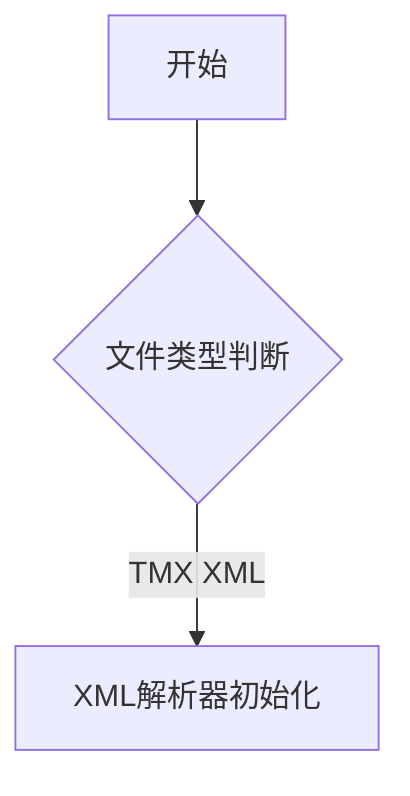
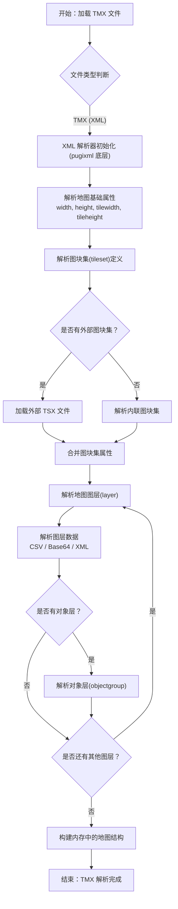
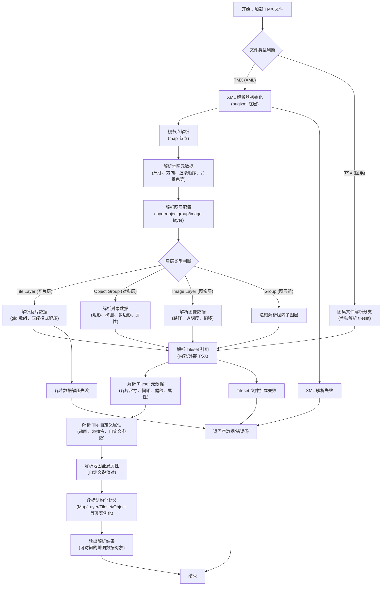
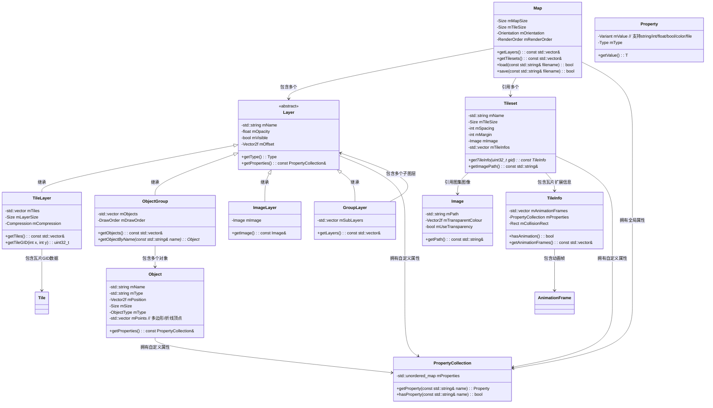

## 







```c++
std::vector<std::unique_ptr<Texture>> textures;
std::vector<std::unique_ptr<MapLayer>> renderLayers;

//load the tile map
tmx::Map map;
if (map.load("assets/demo.tmx"))
{
    //load the textures as they're shared between layers
    const auto& tileSets = map.getTilesets();
    assert(!tileSets.empty());
    for (const auto& ts : tileSets)
    {
        textures.emplace_back(std::make_unique<Texture>());
        if (!textures.back()->loadFromFile(ts.getImagePath(), renderer))
        {
            std::cerr << "Failed opening " << ts.getImagePath() << "\n";
        }
    }

    //load the layers
    const auto& mapLayers = map.getLayers();
    for (auto i = 0u; i < mapLayers.size(); ++i)
    {
        if (mapLayers[i]->getType() == tmx::Layer::Type::Tile)
        {
            renderLayers.emplace_back(std::make_unique<MapLayer>());
            renderLayers.back()->create(map, i, textures); //just cos we're using C++14
        }
    }
}


//enter loop...
SDL_SetRenderDrawColor(renderer, 100, 149, 237, 255);

bool running = true;
while (running)
{
    //pump events
    SDL_Event evt;
    while (SDL_PollEvent(&evt))
    {
        if (evt.type == SDL_QUIT)
        {
            running = false;
        }
        else if (evt.type == SDL_KEYDOWN)
        {
            switch (evt.key.keysym.sym)
            {
            default: break;
            case SDLK_ESCAPE:
                running = false;
                break;
            }
        }
    }

    //clear/draw/display
    SDL_RenderClear(renderer);
    for (const auto& l : renderLayers)
    {
        l->draw(renderer);
    }
    SDL_RenderPresent(renderer);
}
```
